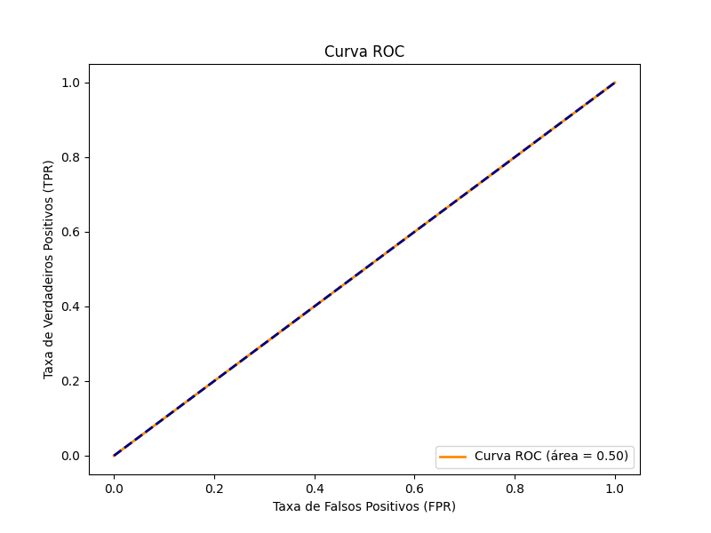
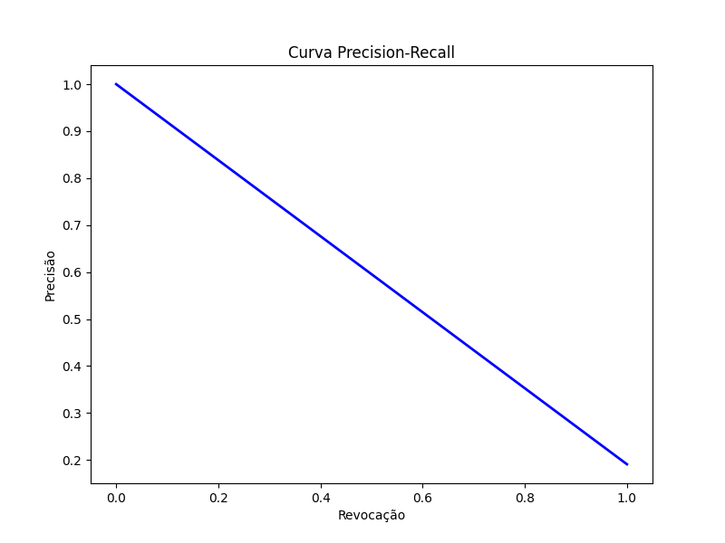
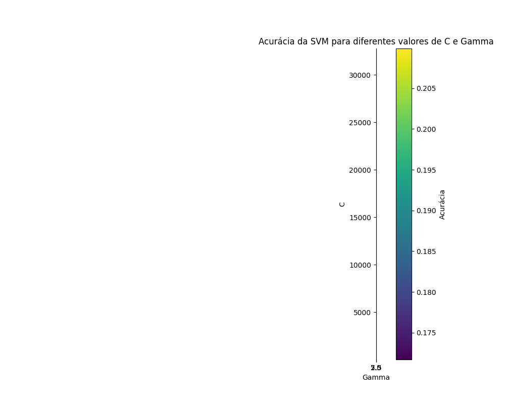
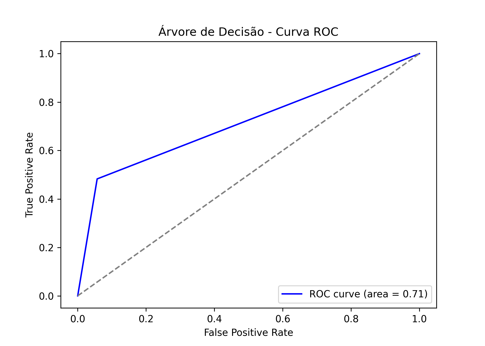
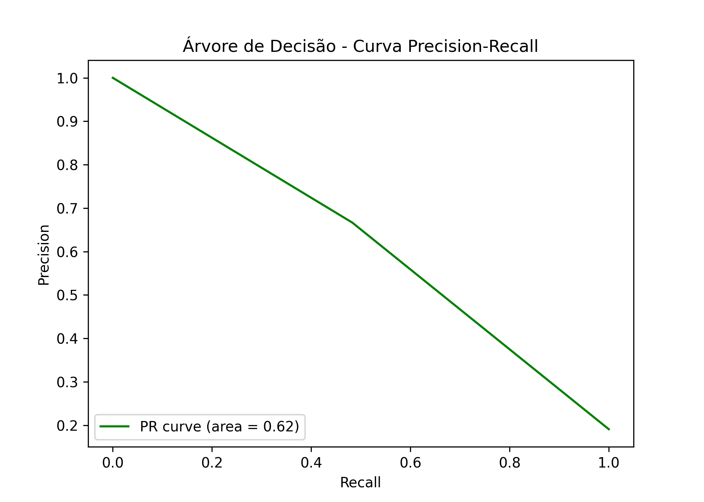

# 5ª Lista de Exercícios - Árvores de Decisão e SVM  

**Curso:** Ciência da Computação  
**Instituição:** Instituto Federal do Ceará, Campus Maracanaú  
**Professor:** Hericson Araújo  
**Disciplina:** Reconhecimento de Padrões  
**Aluno:** Francisco Aldenor Silva Neto  
**Matrícula:** 20221045050117  

---

## **Introdução**  

A tarefa consiste na implementação e avaliação de modelos de classificação binária utilizando SVM e Árvores de Decisão para o conjunto de dados `bostonbin.csv`. O objetivo principal é explorar a eficiência desses algoritmos no contexto de classificação, com ajustes de hiperparâmetros via Grid Search.  

---

## **Descrição do Conjunto de Dados**  

O conjunto de dados `bostonbin.csv` possui 18 colunas:  
- **17 primeiras colunas:** Atributos relacionados às características dos imóveis.  
- **Última coluna (variável alvo):**  
  - **0:** Preços abaixo da média.  
  - **1:** Preços acima da média.  

---

## **Divisão dos Dados**  

Os dados foram divididos em:  
- **70% para treinamento.**  
- **30% para teste.**  

---

## **Metodologia**  

### **1. Suporte Vetorial Máquina (SVM)**  

- **Kernel:** RBF (Radial Basis Function).  
- **Hiperparâmetros ajustados por Grid Search:**  
  - **C:** \(2^{-5}, 2^{-3}, 2^{-1}, \dots, 2^{15}\).  
  - **Gamma:** \(2^{-15}, 2^{-13}, 2^{-11}, \dots, 2^3\).  

### **2. Árvores de Decisão**  

- **Critério de divisão:** Índice de Gini.  
- **Hiperparâmetros ajustados por Grid Search:**  
  - **Altura máxima da árvore:** De 1 a 10.  
  - **Número mínimo de amostras em um nó folha:** De 1 a 5.  

---

## **Resultados**  

### **1. Suporte Vetorial Máquina (SVM)**  

**Melhor modelo SVM:**  
- **C:** \(0.03125\)  
- **Gamma:** \(3.0517578125 \times 10^{-5}\)  

**Métricas no conjunto de teste:**  
- **Acurácia:** 0.1908  
- **Precisão:** 0.1908  
- **Revocação:** 1.0000  
- **F1-Score:** 0.3204  

**Gráficos gerados para SVM:**  

- **Curva ROC:**  
    

- **Curva Precision-Recall:**  
    

- **Acurácia por Configuração:**  
    

---

### **2. Árvores de Decisão**  

**Melhor modelo Árvore de Decisão:**  
- **Altura Máxima da Árvore:** 1  
- **Número Mínimo de Amostras em um Nó Folha:** 1  

**Métricas no conjunto de teste:**  
- **Acurácia:** 0.8553  

**Gráficos gerados para Árvores de Decisão:**  

- **Curva ROC:**  
    

- **Curva Precision-Recall:**  
    

---

## **Visualizações**  

As visualizações incluem:  
1. **Curva ROC:** Avaliação da relação entre sensibilidade e especificidade.  
2. **Curva Precision-Recall:** Análise da relação entre precisão e revocação.  

---

## **Conclusões**  

Os resultados indicam que:  
1. **SVM:** Apesar de alcançar uma revocação perfeita (1.0000), apresentou baixa acurácia (0.1908) e precisão (0.1908), sugerindo desempenho insuficiente para o problema.  
2. **Árvores de Decisão:** Demonstrou maior capacidade preditiva, com uma acurácia significativa de 0.8553.  

## **Repositório**  
  [Repositório no GitHub - SVM e Árvore de Decisão](https://github.com/Aldenor-Neto/SVM_and_decision_tree)
